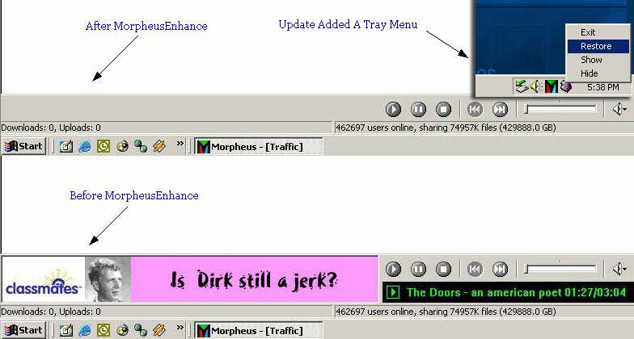



## Morpheus Enhance Updated

### Description

This is a program to get rid of the ad in the file sharing application Morpheus. Please vote if you like the program or find it useful in any way :) Updated the code to hide any of the Morpheus popup ads aswell not exactally perfect but it works well. Ok new update by request I added a tray menu so you don't have to have the window open all the time.
 
### More Info
 

             |
---                |---
**Submitted On**   |2002-02-22 17:30:58
**By**             |[AutoBot](https://github.com/Planet-Source-Code/PSCIndex/blob/master/ByAuthor/autobot.md)
**Level**          |Intermediate
**User Rating**    |5.0 (50 globes from 10 users)
**Compatibility**  |VB 6\.0
**Category**       |[Windows API Call/ Explanation](https://github.com/Planet-Source-Code/PSCIndex/blob/master/ByCategory/windows-api-call-explanation__1-39.md)
**World**          |[Visual Basic](https://github.com/Planet-Source-Code/PSCIndex/blob/master/ByWorld/visual-basic.md)
**Archive File**   |[Morpheus\_E569212222002\.zip](https://github.com/Planet-Source-Code/autobot-morpheus-enhance-updated__1-32013/archive/master.zip)

### API Declarations

All Api Baby !!!

